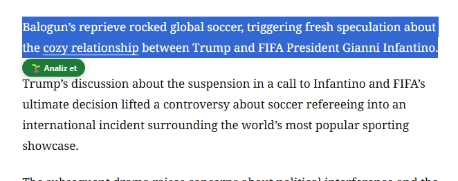
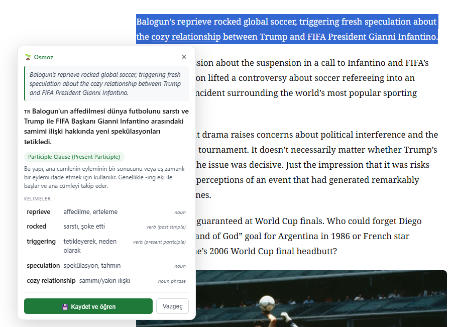
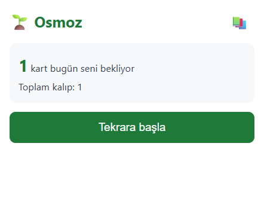
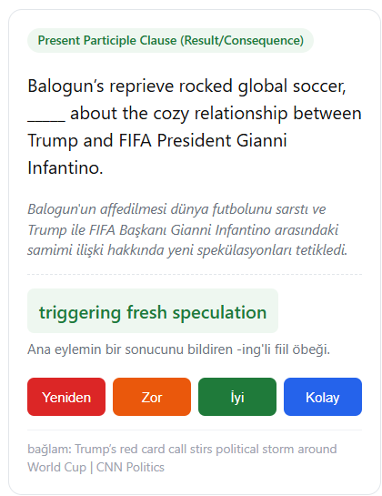

# Osmoz

A Chrome extension that turns your English web reading into passive language learning.
*İngilizce web okumanı pasif dil öğrenmeye çeviren bir Chrome uzantısı.*

Select a sentence anywhere, get a small analysis, save it, and let it come back to you as a flashcard some days later.
*Herhangi bir yerde bir cümle seç, küçük bir analiz al, kaydet, birkaç gün sonra kart olarak karşına gelsin.*

---

## Why this exists
*Neden bu şey var*

The main thing about learning a language is exposure, not sitting down with a textbook.
*Dil öğrenmenin asıl olayı maruz kalmak; ders kitabına gömülmek değil.*

We already spend hours reading English tweets, articles, Reddit threads and video captions.
*Zaten saatlerce İngilizce tweet, makale, Reddit gönderisi ve video altyazısı okuyoruz.*

Most tools stop at translation. But translation alone does not tell you why a phrase is in that form, whether it is a phrasal verb, an inversion, or an idiom.
*Araçların çoğu çeviride kalıyor. Ama çeviri tek başına bir öbeğin neden o halde olduğunu, phrasal verb mü, devrik yapı mı, deyim mi olduğunu söylemiyor.*

Osmoz sits quietly in the background of your normal browsing and, when you want it, gives you a small structured explanation of a sentence — then remembers it for you.
*Osmoz normal gezintinin arka planında sessizce duruyor, istediğinde bir cümlenin küçük yapılandırılmış açıklamasını veriyor ve sonra senin adına hatırlıyor.*

---

## How it works
*Nasıl çalışıyor*

### 1. Select a sentence
*Cümleyi seç*

Highlight any English text on any website with your mouse. A small green button appears just below your selection.
*Fare ile herhangi bir sitedeki İngilizce metni seç. Seçimin hemen altında küçük yeşil bir buton çıkıyor.*

### 2. Read the analysis
*Analizi oku*

Click the button. In one or two seconds a card opens with the Turkish translation, the grammar name, a short note about why the sentence is in that form, and the key words.
*Butona tıkla. Bir iki saniye içinde Türkçe çeviri, grammar adı, cümlenin neden o halde olduğuna dair kısa bir not ve anahtar kelimelerin bulunduğu bir kart açılıyor.*

There is no chat. You do not ask questions. The card is the whole interaction.
*Sohbet yok. Soru sormuyorsun. Kart tek etkileşim.*

### 3. Save and let it come back
*Kaydet ve geri gelmesine izin ver*

When you save a sentence, the extension does something quiet in the background: it also generates three more example sentences that use the same grammar pattern in different contexts.
*Bir cümleyi kaydettiğinde uzantı arka planda sessiz bir şey yapıyor: aynı grammar kalıbını farklı bağlamlarda kullanan üç örnek cümle daha üretiyor.*

You never see these three sentences directly. They enter your review queue and show up on different days, in different clothes.
*Bu üç cümleyi doğrudan görmüyorsun. Tekrar kuyruğuna giriyorlar ve farklı günlerde, farklı kıyafetlerde karşına çıkıyorlar.*

The idea is Krashen's comprehensible input: see the same pattern in different real sentences until it becomes yours.
*Fikir Krashen'in comprehensible input teorisi: aynı kalıbı farklı gerçek cümlelerde gör, ta ki seninleşene kadar.*

### 4. Daily review
*Günlük tekrar*

Click the extension icon in the top right of Chrome. The home screen tells you how many cards want your attention today.
*Chrome'un sağ üstündeki uzantı simgesine tıkla. Ana ekran bugün kaç kartın seni istediğini söylüyor.*

Each card is a fill-in-the-blank. You read the sentence, guess the missing part in your head, then reveal the answer.
*Her kart bir boşluk doldurma. Cümleyi okuyorsun, boşluğu içinden söylüyorsun, sonra cevabı açıyorsun.*

Four buttons decide when the card will return: Again, Hard, Good, Easy. Behind them is an FSRS-inspired spaced repetition scheduler.
*Dört buton kartın ne zaman geri döneceğini belirliyor: Yeniden, Zor, İyi, Kolay. Arkasında FSRS ilhamlı bir spaced repetition zamanlayıcısı var.*

---

## Installation
*Kurulum*

1. Download this repository as a ZIP and unzip it somewhere you will not delete by accident.
   *Bu depoyu ZIP olarak indir ve kazara silmeyeceğin bir yere aç.*
2. Open Chrome and go to `chrome://extensions`.
   *Chrome'da `chrome://extensions` adresine git.*
3. Turn on Developer mode from the top right.
   *Sağ üstten Geliştirici modunu aç.*
4. Click "Load unpacked" and pick the folder you unzipped.
   *"Load unpacked" (Paketlenmemiş yükle) butonuna tıkla ve açtığın klasörü seç.*
5. The Osmoz settings page opens automatically the first time.
   *Osmoz ayarlar sayfası ilk sefer otomatik olarak açılıyor.*

Note: if you delete the folder later, the extension will break in Chrome. Keep the folder somewhere safe.
*Not: klasörü sonradan silersen uzantı Chrome'da çalışmaz olur. Klasörü güvenli bir yerde tut.*

---

## Getting a free API key
*Ücretsiz API key almak*

Osmoz uses Google Gemini 2.5 Flash for analysis. You bring your own key, which stays only on your machine.
*Osmoz analiz için Google Gemini 2.5 Flash kullanıyor. Kendi anahtarını sen getiriyorsun ve sadece senin bilgisayarında kalıyor.*

1. Go to [aistudio.google.com/apikey](https://aistudio.google.com/apikey).
   *[aistudio.google.com/apikey](https://aistudio.google.com/apikey) adresine git.*
2. Sign in with a Google account.
   *Google hesabınla giriş yap.*
3. Click "Create API key" and copy it.
   *"Create API key" butonuna bas ve anahtarı kopyala.*
4. Paste it into the Osmoz settings page and press "Test et".
   *Anahtarı Osmoz ayarlar sayfasına yapıştır ve "Test et"e bas.*

The free tier gives you fifteen requests per minute and around fifteen hundred per day. This is far more than one person can use.
*Ücretsiz katman dakikada on beş, günde yaklaşık bin beş yüz istek veriyor. Bir kişinin kullanabileceğinin çok üstünde.*

---

## What it does not do yet
*Henüz yapmadığı şeyler*

These are the things I know are missing and want to add later. If you are looking at this and want to help, pick one.
*Eksik olduğunu bildiğim ve sonra eklemek istediğim şeyler. Bunu görüp yardım etmek istiyorsan birini seç.*

- Read text from inside images. Right now the extension only sees selectable web text, so tweet screenshots with captions on the image, Netflix subtitles, and video overlays are invisible to it.
  *Görsellerin içindeki yazıyı okuma. Şu an uzantı sadece seçilebilir web metnini görüyor; görsel üstüne yazılmış caption'lı tweet ekran görüntüleri, Netflix altyazıları ve video overlay'leri onun için görünmez.*
- A proper icon set. Chrome currently shows a default puzzle piece.
  *Düzgün bir icon seti. Chrome şu anda default puzzle parçasını gösteriyor.*
- Dark mode for the in-page card and the popup.
  *Sayfa içi kart ve popup için karanlık mod.*
- YouTube subtitle integration so you can click a word in the caption without pausing.
  *YouTube altyazı entegrasyonu — videoyu durdurmadan bir kelimeye tıklayabilesin.*
- Statistics: which grammar patterns you keep saving, which ones you keep failing.
  *İstatistik: hangi grammar kalıplarını sürekli kaydediyorsun, hangilerinde sürekli takılıyorsun.*
- Prompt personalisation so the analysis matches your level over time.
  *Prompt kişiselleştirme — analiz zamanla senin seviyene uysun.*
- Export and import of your saved patterns.
  *Kaydedilen kalıpları dışa aktarma ve içe aktarma.*

---

## Under the hood
*Kaputun altında*

- Manifest V3 Chrome extension, plain JavaScript, no build step.
  *Manifest V3 Chrome uzantısı, sade JavaScript, build adımı yok.*
- Content script draws the little green button and the analysis card into the page.
  *Content script küçük yeşil butonu ve analiz kartını sayfaya çiziyor.*
- Background service worker calls Gemini with a structured JSON schema so the model always returns the same shape.
  *Background service worker Gemini'yi yapılandırılmış bir JSON şeması ile çağırıyor; model her zaman aynı şekilde cevap veriyor.*
- IndexedDB stores your notes and cards on your own machine.
  *IndexedDB not ve kartları senin makinende saklıyor.*
- A small FSRS-inspired scheduler decides when each card should come back.
  *Küçük bir FSRS ilhamlı zamanlayıcı her kartın ne zaman geri döneceğine karar veriyor.*

Nothing leaves your browser except the request to Gemini, and that only goes out when you press analyze.
*Tarayıcından tek çıkan şey Gemini'ye giden istek, o da sadece sen analiz'e bastığında.*

---

## License

MIT. Do whatever you want with it.
*MIT. Ne istersen yap.*
